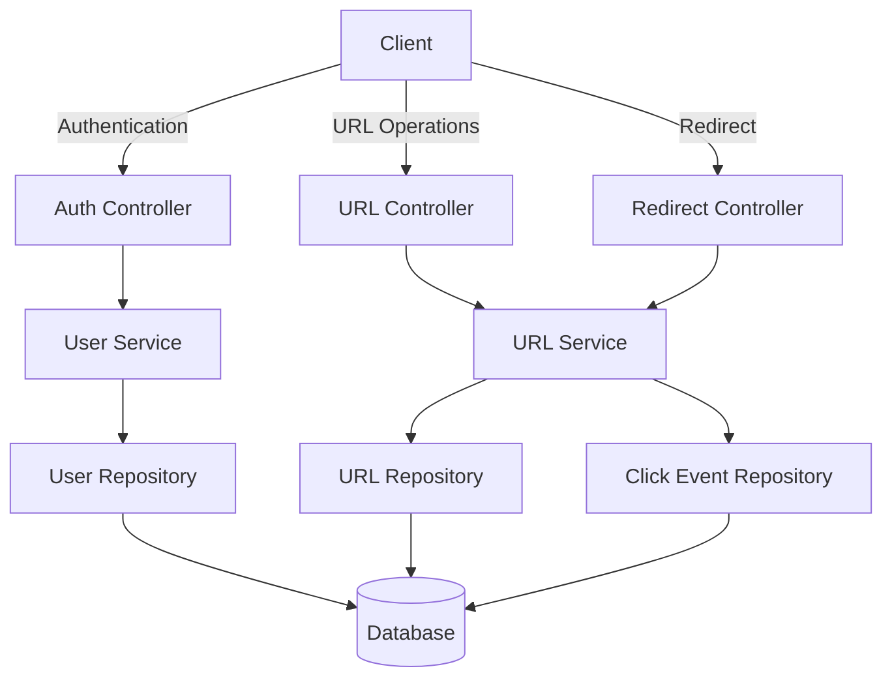
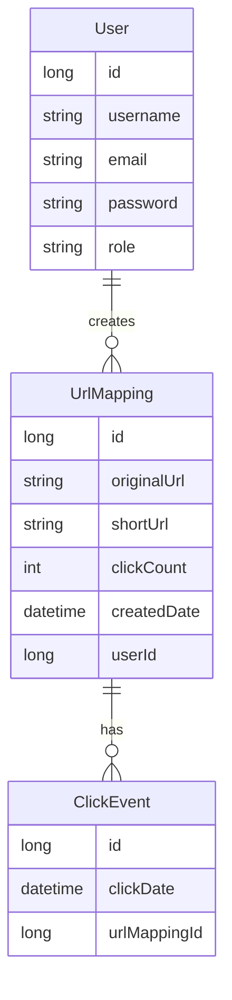

# URL Shortener Backend
A Spring Boot based URL shortening service with user authentication and analytics.

## Features
- URL shortening with custom length (8 characters)
- User registration and authentication using JWT
- Click analytics and tracking
- Secure endpoints with Spring Security
- RESTful API design
- Cloud PostgreSQL database for persistence

## Tech Stack
- Java 21
- Spring Boot 3.5.4
- Spring Security
- JWT Authentication
- PostgreSQL (Railway for development)
- Maven
- Lombok

## System Architecture


## API Endpoints

### Authentication
```
POST /api/auth/public/register
POST /api/auth/public/login
```

### URL Operations
```
POST /api/urls/shorten
GET /api/urls/myurls
GET /api/urls/analytics/{shortUrl}
GET /api/urls/totalClicks
GET /{shortUrl}
```

## Database Schema


## Setup Guide

### Prerequisites
- JDK 21
- Maven
- PostgreSQL (local or Cloud)

### Configuration
Create `application.properties` in `src/main/resources/`:

```properties
# Server Configuration
server.port=8080

# Database Configuration
spring.datasource.url=your_database_url
spring.datasource.username=your_username
spring.datasource.password=your_password
spring.datasource.driver-class-name=org.postgresql.Driver

# JPA Configuration
spring.jpa.hibernate.ddl-auto=update
spring.jpa.show-sql=true
spring.jpa.properties.hibernate.dialect=org.hibernate.dialect.PostgreSQLDialect

# JWT Configuration
jwt.secret=your_jwt_secret_key
jwt.expiration=Jwt_Expiration_time(in ms)

# Frontend URL for CORS
frontend.url=http://localhost:3000
```

### Building the Project
```bash
# Clone the repository
git clone https://github.com/yourusername/url-shortener.git

# Navigate to the project directory
cd url-shortener

# Build the project
mvn clean install

# Run the application
mvn spring-boot:run
```

## API Documentation

### Register User
```http
POST /api/auth/public/register
Content-Type: application/json

{
    "username": "string",
    "email": "string",
    "password": "string"
}
```

### Login User
```http
POST /api/auth/public/login
Content-Type: application/json

{
    "username": "string",
    "password": "string"
}
```

### Shorten URL
```http
POST /api/urls/shorten
Authorization: Bearer {jwt_token}
Content-Type: application/json

{
    "originalUrl": "string"
}
```

### Get User's URLs
```http
GET /api/urls/myurls
Authorization: Bearer {jwt_token}
```

### Get URL Analytics
```http
GET /api/urls/analytics/{shortUrl}?startDate={date}&endDate={date}
Authorization: Bearer {jwt_token}
```

### Get Total Clicks
```http
GET /api/urls/totalClicks?startDate={date}&endDate={date}
Authorization: Bearer {jwt_token}
```

## Contributing
1. Fork the repository
2. Create your feature branch (`git checkout -b feature/AmazingFeature`)
3. Commit your changes (`git commit -m 'Add some AmazingFeature'`)
4. Push to the branch (`git push origin feature/AmazingFeature`)
5. Open a Pull Request

## License

```
MIT License

Copyright (c) 2025 [Rugved Agasti]

Permission is hereby granted, free of charge, to any person obtaining a copy
of this software and associated documentation files (the "Software"), to deal
in the Software without restriction, including without limitation the rights
to use, copy, modify, merge, publish, distribute, sublicense, and/or sell
copies of the Software, and to permit persons to whom the Software is
furnished to do so, subject to the following conditions:

The above copyright notice and this permission notice shall be included in all
copies or substantial portions of the Software.

THE SOFTWARE IS PROVIDED "AS IS", WITHOUT WARRANTY OF ANY KIND, EXPRESS OR
IMPLIED, INCLUDING BUT NOT LIMITED TO THE WARRANTIES OF MERCHANTABILITY,
FITNESS FOR A PARTICULAR PURPOSE AND NONINFRINGEMENT. IN NO EVENT SHALL THE
AUTHORS OR COPYRIGHT HOLDERS BE LIABLE FOR ANY CLAIM, DAMAGES OR OTHER
LIABILITY, WHETHER IN AN ACTION OF CONTRACT, TORT OR OTHERWISE, ARISING FROM,
OUT OF OR IN CONNECTION WITH THE SOFTWARE OR THE USE OR OTHER DEALINGS IN THE
SOFTWARE.
```
